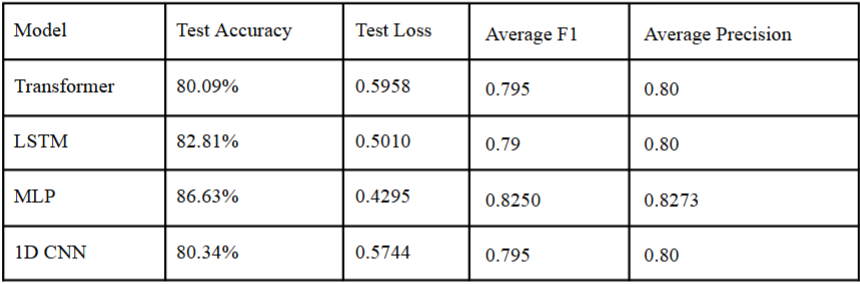
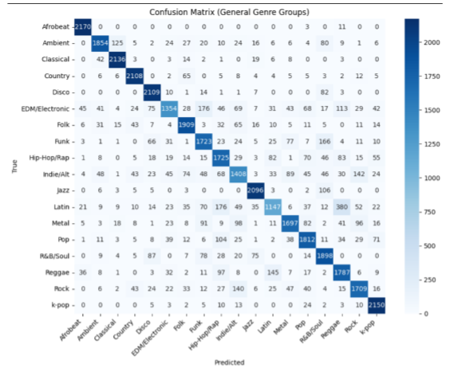
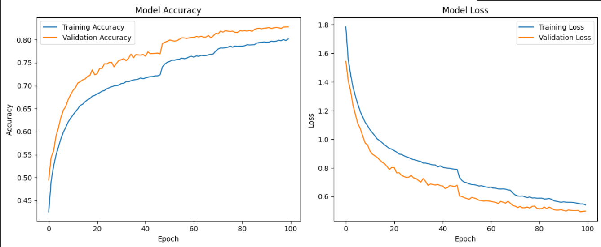

# Genre Classification Using Machine Learning Methods

Automatic Music Genre Classification (AMGC) using the **Spotify Tracks Dataset** (tabular track metadata/features).  
This project compares multiple ML architectures to predict a track’s genre and evaluates which model family performs best for this **tabular** classification task.

**Course:** CAP5610 (Spring 2025)  
**Team:** Group 8 (Fort Knight) — Natalie Nguyen, Jack Price, Jeovani Overstreet, Vicente Sosa L.

**Fork note:** This repository is a fork of the original group repo. I use this fork as a portfolio-ready version and to clearly document results and **my LSTM contribution**.

**Authors / Contributions**
- Natalie Nguyen — 1D CNN  
- **Jack Price — LSTM**  
- Jeovani Overstreet — MLP  
- Vicente Sosa L. — Transformer  

---

## Project Overview
Music genre labeling can be inconsistent and subjective across platforms. This project evaluates how well different machine learning architectures classify genres using track-level features from the Spotify Tracks Dataset.

Models compared:
- **MLP (Multi-Layer Perceptron)**
- **1D CNN**
- **LSTM**
- **Transformer**

---

## Dataset
- **Spotify Tracks Dataset** (Kaggle) by Maharshi Pandya (2022)
- Input: tabular features/metadata (not raw audio)
- Labels: genres (reduced to a smaller set to make classification more stable and meaningful)

---

## Methodology

### Metrics
We evaluate using:
- Accuracy
- Loss
- Precision / Recall / F1-score (including per-genre performance)
- Confusion matrices

### LSTM (My Contribution)
My primary contribution was the **LSTM model** and its evaluation.

LSTM configuration:
- Learning rate: **0.002**
- Dropout: **0.1**
- Batch size: **32**
- Training: **100 epochs** with **early stopping**
- Architecture: **2 Bidirectional LSTM layers** (128 units then 64 units), Dense(32), Softmax output

---

## Results Summary (Test Set)

| Model        | Test Accuracy | Test Loss | Avg F1  | Avg Precision |
|-------------|---------------|----------:|--------:|--------------:|
| Transformer | 80.09%        | 0.5958    | 0.795   | 0.80          |
| **LSTM**    | **82.81%**    | 0.5010    | 0.79    | 0.80          |
| **MLP**     | **86.63%**    | 0.4295    | 0.8250  | 0.8273        |
| 1D CNN      | 80.34%        | 0.5744    | 0.795   | 0.80          |

**Key takeaway:** The **MLP performed best overall**, which aligns with expectations for tabular feature classification.

---

## Visuals
Add these images to an `assets/` folder in the repo to enable the embeds below.

### Model Comparison (Accuracy / F1)


### LSTM Confusion Matrix


### Training Curves (LSTM)


---

## How to Run
1. Install dependencies:
   ```bash
   pip install -r requirements.txt
